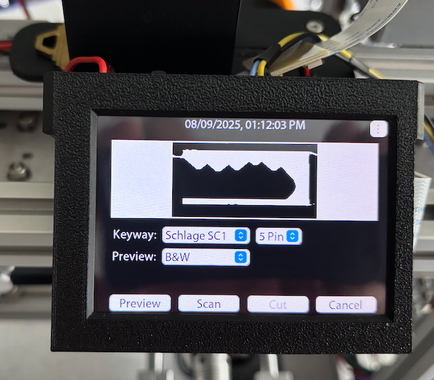
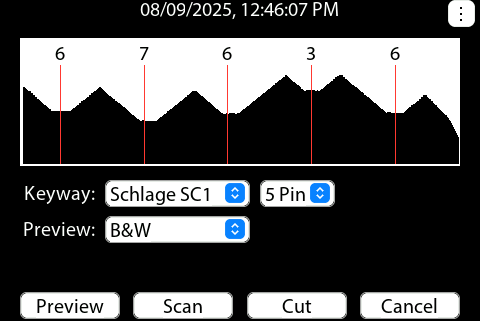

# Key Reader

  

This project is a [Key Code Cutter](https://www.instructables.com/Key-Code-Cutter/) accessory.  The Key Reader uses a camera to determine a key's code and sends the code to the Key Code Cutter to be cut.

The software is designed to run on my "STM32F429 3.5TFT & Camera v1.0" board.

  

## SdFat
<pThis project uses an unmodified version of Bill Greiman's SdFat library. Copyright Bill Greiman 2011-2024 (currently using version 2.2.3)  This can be loaded using the Arduino IDE's library manager.

 
 

  

  

**Actions:**
- Preview streams either color or black and white video so that the user can verify that the key is aligned properly.
- Scan takes a high res image, then analyzes the image to determine the key code.
- Cut, enabled after a valid scan, sends the key code information to the Key Code Cutter to be cut.

See my 
[Key Reader](https://www.instructables.com/Key-Reader/) instructable for more information.

The instructable contains links to where the bare PCB can be purchased.

